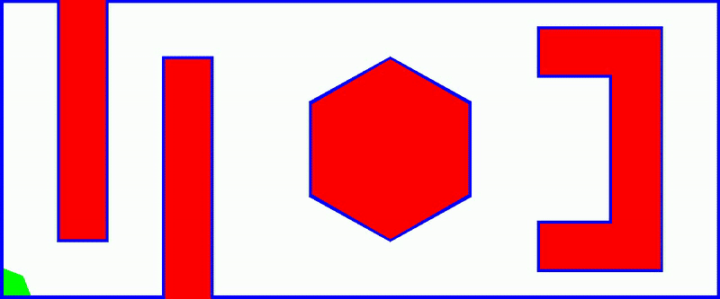

# Dijkstra's Algorithm for Pathfinding

## Author
**Name:** FNU Koustubh  
**Email:** koustubh@umd.edu 

## Overview
This project implements Dijkstra's algorithm for pathfinding in a 2D grid environment. The environment includes obstacles and an 8-connected space for movement. The algorithm finds the shortest path between a user-defined start and goal point, visualizing the explored nodes and generating a video output.

## Features
- **Obstacle Representation**: Defined rectangular, C-shaped, and hexagonal obstacles in the environment.
- **8-Connected Movement**: Includes diagonal, vertical, and horizontal movements with respective costs.
- **Dijkstra’s Algorithm**: Uses a priority queue (min-heap) for efficient shortest path computation.
- **Visualization**: Generates an output video (`output.mp4`) showing the exploration process and final path.

## Dependencies
Ensure you have the following dependencies installed:

```sh
pip install numpy opencv-python
```

## How to Run
1. Clone the repository:
   ```sh
   git clone https://github.com/koustubh1012/enpm661_project2_dijkstra.git
   ```
2. Navigate to the project directory:
   ```sh
   cd enpm661_project2_dijkstra
   ```
3. Run the script:
   ```sh
   python dijkstra.py
   ```
4. Enter the start and goal coordinates when prompted.

## Input Format
- The script prompts the user for **start** and **goal** coordinates.
- Invalid inputs (points inside obstacles) will be rejected, and re-entry will be required.

## Output
- The script generates an `output.mp4` video demonstrating the algorithm’s execution.
- The explored nodes are marked in **green**, obstacles in **red**, and the final path (if found) will be highlighted.



## Example Usage
```sh
Enter the Start Point X coordinate: 50
Enter the Start Point Y coordinate: 50
Enter the Goal Point X coordinate: 1000
Enter the Goal Point Y coordinate: 450
```

## Known Issues
- The current implementation does not account for dynamic obstacles.
- Large maps may slow down processing due to the high number of nodes.

## Future Improvements
- Implementing A* for better performance.
- Adding interactive GUI for real-time visualization.
- Supporting dynamic obstacle avoidance.

## License
This project is open-source and free to use under the MIT License.

